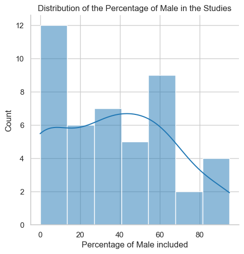

# systematic_review

Code for Systematic Literature review on language marker for PTSD.
Using the Notebook "reproduce_figure_and_analysis.ipynb" you can reproduce the figures and analysis of the paper.

## Abstract
Background: Diagnosing PTSD remains a challenge due to symptom variability and comorbidities. Linguistic analysis offers an innovative approach to identifying PTSD symptoms and severity.
Aims: This systematic review aims to identify linguistic features associated with PTSD, assess the quality and limitations of existing studies, summarize the predictive performance of identified models, and describe the clinical utility of these models.
Method: A comprehensive search was conducted across multiple databases, resulting in the identification of 593 articles. After screening and eligibility assessment, 57 studies were included. Data extraction focused on study characteristics, methodology, and performance metrics. The risk of bias was assessed using the PROBAST tool, and a narrative synthesis and meta-analysis were performed.
Results: Linguistic features such as pronoun use, emotional valence, cognitive processing words, narrative length, discourse disorganization, temporal orientation, specific lexical fields (death, Anxiety, sensory-perception details), and disfluencies were commonly investigated. The meta-analysis revealed a pooled AUC of 0.81, indicating the high performance of classification models. However, significant publication bias and heterogeneity were noted. Only eight studies were rated with a low risk of bias, highlighting common issues such as inadequate control groups, unvalidated linguistic tools, unvalidated diagnosis tools, and low rigor in statistical analysis.
Conclusions: Linguistic markers show potential for enhancing PTSD diagnosis, but current research is limited by methodological inconsistencies and biases. Future research should focus on standardized tools, symptom-focused studies, and interdisciplinary collaboration to improve the robustness and clinical applicability of findings.

## Data
The data used in this study is available in the data folder. 
The TSV file is used for the Gargantex analysis : https://academia.sub.gargantext.org/ 
The CSV file is used for the analysis in the notebook.

## Figures
Here are the figures produced in the notebook:

Figure 2. Number of Studies Over Time (Grouped by 2-Year Intervals)

Figure 3. Sankey diagram

Figure 4.  Distribution of Sample Size Depending on the Type  Diagnosis Tool Used

Figure 5. Distribution of the Percentage of Males in the Studies

Figure 6. Distribution of prevalence of PTSD depending on the Type of Diagnosis Tool Used	

Figure 7. Distribution of prevalence of PTSD depending on the type of Exposition

Figure 8. The kind of method used  to extract language features versus the Discipline involved

Figure 9. The most common Comorbidity and co-founding factors employed in the studies

Figure 10. Co-occurrence of Statistical Frameworks used in the studies included

Figure 11. Forest plot of the studies that report AUC score or equivalent

 Figure 12. Funnel plot of the study providing classification performances (AUC or equivalent)

Figure 13. Galbraith Plot of Standardized Effect Sizes vs. Precision for Studies including performance metrics.

